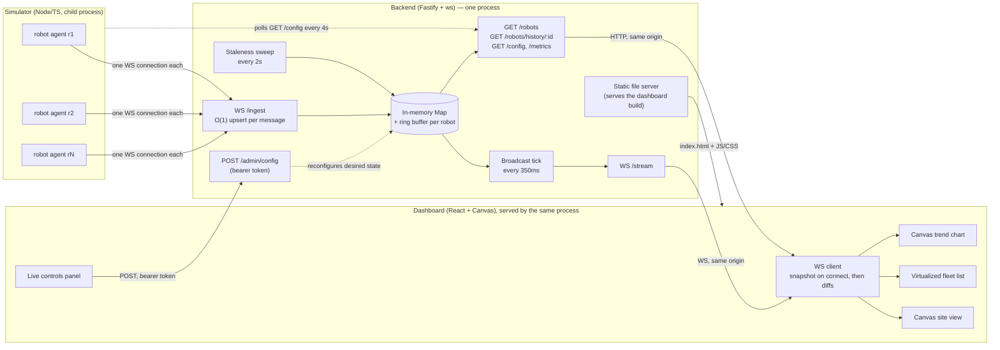

# Architecture

## One diagram

## Publish → pixel, in one paragraph

A simulated robot agent opens one WebSocket to `/ingest` and, on connect, sends a one-time `{robot_id, robot_type, start}` registration message, then a `TelemetryEvent` (`t, robot_id, x, y, status, battery, seq`) every `update_interval_ms`. The backend's ingest handler parses and validates each message and does an **O(1) map upsert** — no per-robot queue, no blocking wait on anything downstream — comparing the incoming `seq` (or `t` if `seq` is absent) against what's already stored for that `robot_id` and discarding anything older, so a stale/reordered packet can never roll a robot's displayed state backwards. On a fixed, ingestion-rate-independent tick (`BROADCAST_TICK_MS`, default 350ms), the backend gathers every robot that changed since the last tick into one batched `diff` message and sends it to every connected dashboard, skipping any client whose outbound buffer is backed up rather than blocking the loop for everyone else. Independently, a staleness sweep (every `STALENESS_SWEEP_MS`) marks any robot silent for `3 × update_interval_ms` as `offline` itself — a robot is never trusted to announce its own disconnect. The dashboard's WebSocket client applies `snapshot` messages wholesale and `diff` messages incrementally into a plain (non-React) `Map`; a Canvas-based site view redraws every animation frame straight from that map (smoothing positions toward each newly-reported point rather than snapping), while the fleet list and trend chart poll it on a coarser, fixed cadence so sorting/filtering thousands of rows doesn't compete with 60fps rendering.

## Failure handling

| Failure | Handling | Where |
|---|---|---|
| Robot's connection drops | Simulator reconnects with exponential backoff + jitter (0.5s → 15s cap). Backend doesn't act on the close event itself — the staleness sweep is the single source of truth for "is this robot really gone." | `robotAgent.ts`, `staleness.ts` |
| Backend hasn't heard from a robot in `3× update_interval` | Marked `offline` server-side, `needs_attention`, `last_seen` preserved. If it was `on_mission`, `last_mission_context` is kept so the dashboard can show "last seen mid-mission" instead of the task silently vanishing. | `state.ts: sweepStaleness` |
| Dashboard's connection drops | Client reconnects with backoff. Every **new** `/stream` connection (including a reconnect) gets a fresh `snapshot` message before any `diff` — so a dashboard that was offline for 30s doesn't replay 30s of diffs, it just re-syncs instantly from current state. | `useFleetSocket.ts`, `stream.ts` |
| One dashboard client is slow to drain | Backend checks `client.bufferedAmount` before each tick's send; a backed-up client just misses that tick's frame rather than blocking the broadcast loop for every other client. | `stream.ts` |
| Burst of robot updates | Ingestion is a single `Map.set` per message — a burst costs one write per message with no queue that can build a backlog. | `state.ts: upsertTelemetry` |
| Updates arrive late/out of order | Each upsert compares the incoming `seq`/`t` against the stored value and discards anything not newer. | `state.ts: upsertTelemetry` |
| A malformed/unparseable message | Dropped silently at `/ingest` (never crashes the connection); a malformed `/stream` frame is dropped client-side without taking down the socket handler. | `ingest.ts`, `useFleetSocket.ts` |
| Fleet size turned down live | The simulator stops those agents' sockets; the backend doesn't need (or have) an explicit "remove robot" call — a descaled robot is handled by the exact same staleness path as a dropped connection, so it shows `offline`, not vanished. | `simulator/index.ts: reconcileFleetSize` |
| Public `/ingest` endpoint abuse | Per-connection rate limit (200 msgs/sec) independent of how many real robots share it. | `ingest.ts` |

## Data model notes

- **`/stream` and `/robots` always agree** — both read the same `Map`, never a separate copy (PRD §7.7).
- **History persistence (stretch)**: a ring buffer (720 samples/robot ≈ 1 hour at 5s cadence) backs the fast path; SQLite (`better-sqlite3`, WAL mode) backs anything older, merged transparently in `GET /robots/history/:id`. If SQLite's native binding fails to load in a given environment, persistence silently no-ops rather than crashing the backend — live state and streaming are completely independent of it. If it disappeared entirely, the only loss is history older than the in-memory window; nothing about live fleet state depends on it.
- **Obstacle-aware motion**: the simulator plans robot paths with an incremental visibility graph over the 6 obstacle rectangles' corners (precomputed once at startup; each new waypoint only needs to wire the start/goal points into that static graph, not recompute it), then Dijkstra's shortest path. See `FINDINGS.md` for a real bug this caught.

## What changes at 10x fleet size

Going from, say, 200 to 2,000 simulated robots:

- **Ingestion** stays O(1) per message by construction — cost scales with *messages/sec*, not fleet size directly, so it's really `update_interval_ms` that matters here, not `fleet_size` alone.
- **Broadcast payload size** grows with however many robots changed in a given 350ms tick — at high fleet size + short update interval, most of the fleet changes every tick, so the diff message approaches "most of the fleet" in size. This is the first thing we'd expect to show up in the load test as increased tick duration / dashboard bandwidth.
- **Canvas site view** rendering cost is O(n) markers per frame — at a few thousand robots on a 900×560 canvas, markers start visually overlapping regardless of render speed; this becomes a *legibility* problem before it's a *performance* problem. Pan/zoom and the fleet list's "needs attention" filter are the intended way to cope, not a denser canvas.
- **Fleet list** stays cheap because it's virtualized (renders only visible rows) and its own re-render cadence is decoupled from the 60fps canvas loop.
- **Simulator CPU**: each robot's per-tick work (status roll, battery step, path-following) is O(1); pathfinding is only recomputed when a robot needs a *new* waypoint, and that computation is O(static nodes) thanks to the incremental visibility graph, not O(static nodes²). The simulator's own scaling ceiling is more likely to be Node's per-socket overhead (thousands of individual WebSocket connections to the backend) than the per-tick math.
- **What we'd actually change first**, based on the above: raise `BROADCAST_TICK_MS` (trade dashboard latency for smaller/less-frequent diffs) before touching anything else, since it's the cheapest lever and directly targets the bottleneck the reasoning above points at.

See `FINDINGS.md` for real numbers from the deployed instance, once gathered.
